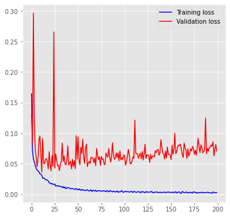
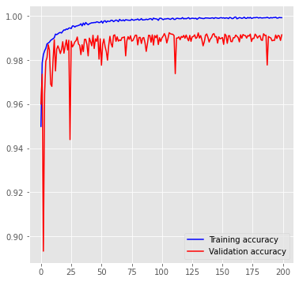
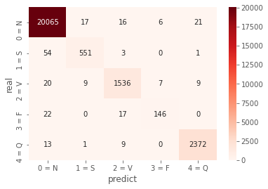
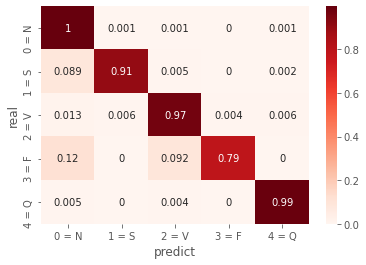
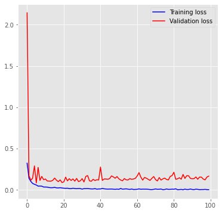
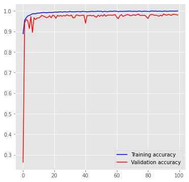
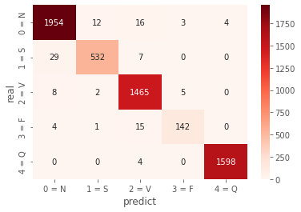
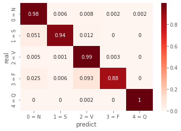

# ECG Classification by GRU Model
- Reference paper : [Interpretation of Electrocardiogram Heartbeat by CNN and GRU](https://www.hindawi.com/journals/cmmm/2021/6534942/)

이전에 진행 했던 [ECG Classification by GB-DBN Model](https://github.com/insung3511) 의 연장선이다. 알아야 할 점은 이번에도 논문을 참고로 한다는 점이다. 어디까지나 참고이므로 논문 내용 그대로 가진 않을수도 있다. 실제 Pre-processing 과정에서 차이가 발생 할 수도 있고, 혹은 다른 문제에 봉착 할 수도 있기 때문이다. 암튼 그게 중요한게 아니고 모델의 구조는 위 논문을 참고하길 바란다. 개인적으로는 위 논문 정말 모델을 그대로 구현하기에는 괜찮다고 생각된다.

이번에도 Pytorch 로 진행될 예정이다. Data는 이전에 Pre-processing을 끝낸 [ecg-rr](https://github.com/ecg-rr) 에서 활용했던 데이터를 갖고와 진행 할 것이다.

이 외의 질문이나 혹은 문제점이 있다면 이메일 혹은 Issue를 해준다면 언제든지 환영이다. :)

# Result
## Data cutted as pickle
- 학습 과정 중에서의 정확도




- Confusion Matrix




```
              precision    recall  f1-score   support

       0 = N       0.99      1.00      1.00     20125
       1 = S       0.95      0.90      0.93       609
       2 = V       0.97      0.97      0.97      1581
       3 = F       0.92      0.79      0.85       185
       4 = Q       0.99      0.99      0.99      2395

    accuracy                           0.99     24895
   macro avg       0.96      0.93      0.95     24895
weighted avg       0.99      0.99      0.99     24895
```

가장 먼저 데이터의 비율이 좋지 않았다. F가 가장 적었고 Non-beat 같은 경우도 동일하게 비율이 맞지 않아 제대로 된 학습이 안될거라고 생각이 되었으나 예상 외로 너무 좋은 결과가 나왔다. Normal beat는 100% 가까이 잡아냈고 다른 beats 또한 나름 준수한 성적을 보여주었다. 

언급한바와 같이 F Class의 정확도는 79%로 굉장히 낮게 나왔지만 어쩔수 없다고 생각한다. 데이터의 비중, 비율 등이 부족했다고 생각 되기에 제대로 찾지 못한 것 같다. 

## Data Rebalanced result
- 학습 과정 중에서의 정확도 및 Loss 값




- Confusion Matrix



```
              precision    recall  f1-score   support

       0 = N       0.98      0.98      0.98      1989
       1 = S       0.97      0.94      0.95       568
       2 = V       0.97      0.99      0.98      1480
       3 = F       0.95      0.88      0.91       162
       4 = Q       1.00      1.00      1.00      1602

    accuracy                           0.98      5801
   macro avg       0.97      0.96      0.96      5801
weighted avg       0.98      0.98      0.98      5801
```

Rebalanced 된 데이터로 돌려서 나온 결과 값이다. 모두 90% 이상의 성능을 보여주고 있으며 Normal 비트보다 Unclassed 비트를 더욱이 잘 찾아내는 결과를 보여주고 있다. 기존 성능 대비 False alarm 비트 또한 더욱이 좋은 성능을 보여준다. 전체 정확도는 F1-Score 기준으로 98%로 나왔다.